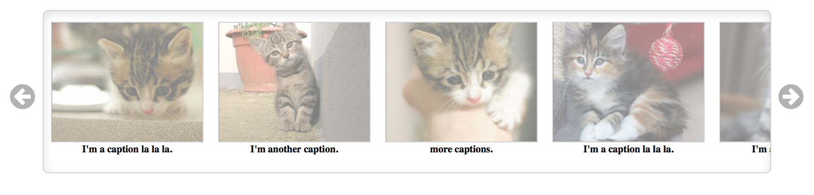

# jQuery Scrollify Plugin
================

This simple jQuery plugin takes a simple list and turns it into a slider with lightbox functionality, like this: 


[demo](http://j4n-co.github.io/jquery.scrollify/) 

## Installation

1. Include jQuery in your html (obviously).  
2. Download this repo
3. Stick the `jquery.scrollify.js`, `jquery.scrollify-style.css` files after your jQuery, like so: 
    ```
    <link href="*Your CSS Path*/jquery-scrollify-style.css" rel="stylesheet">
    ```
    ```
    <script src="*You JS Path*/jquery.scrollify.js"></script>   
    ```
4. Stick font-awesome in your code as well (this is for the nice icons)
    ```
    <link rel="stylesheet" href="http://cdnjs.cloudflare.com/ajax/libs/font-awesome/4.1.0/css/font-awesome.css">
    ```

## Usage

### JS:
no options, no arguments, just `.srollify()` an element. 
```
$(document).ready(function(){
    $('.scroller').scrollify(); 
})
```

### HTML: 
There are some stringent markup requirements here. 

The element to scrollify should be a `<ul>`. 

Each `<li>` inside the `<ul>` should contain an `<a>` element. The `<a>` should have an `href` set to the large image, and a `data-title` attribute containing the caption. Inside the `<a>`, there should be a smaller preview image. 

To show an `iFrame` in the lightbox, for example a youtube video, add the attribute `data-type="iframe"` to the `<a>` element. 

```
<ul class="scroller"> 
    <li>
        <a href="http://placekitten.com/800/800" data-title="caption"> 
	         
        </a>
    </li>
    <li> 
        <a href="http://www.youtube.com/embed/i_mKY2CQ9Kk" data-title="I'm a video." data-type="iframe"> 
             
        </a>
    </li>
</ul> 
```

## Usage

Demo 


#### License
MIT License - fork, modify and use however you want.